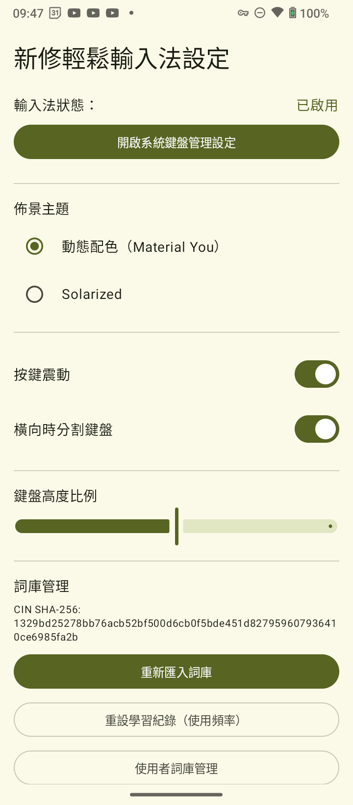
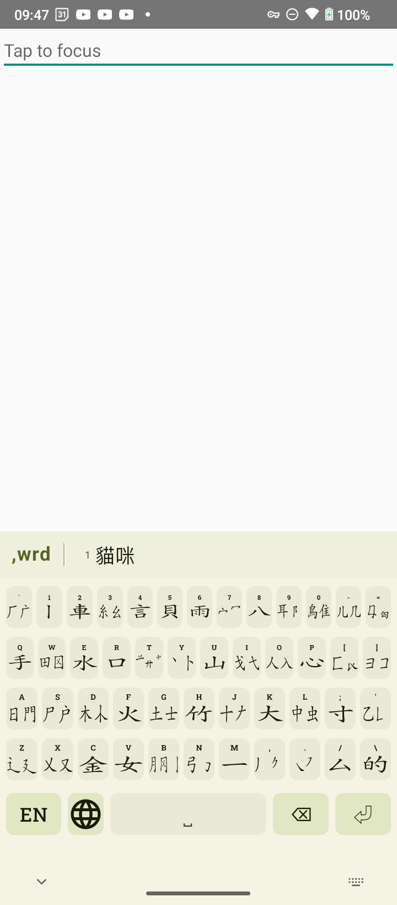
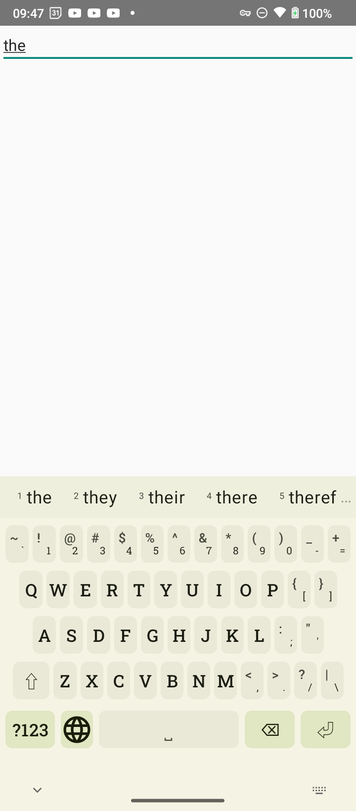
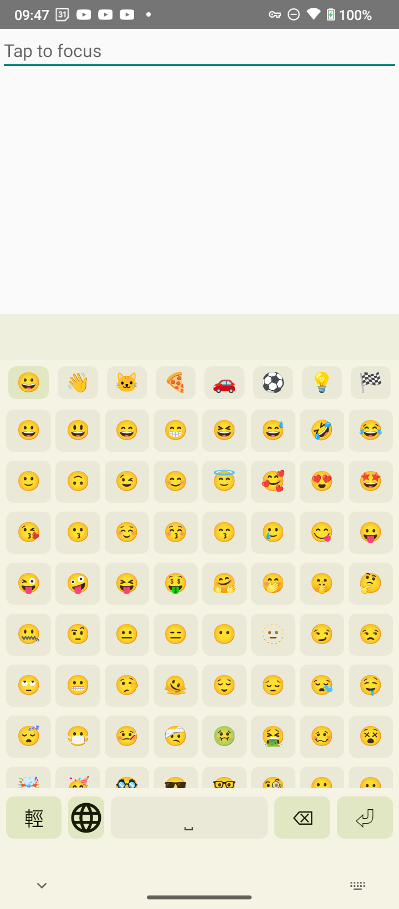

# RakuRaku IME 新修輕鬆輸入法

An Android Input Method Editor (IME) for the **EZ Input Method** (輕鬆輸入法), built with Jetpack Compose and Room Database.

## Screenshots

<table>
  <tr>
    <td align="center">
       
      Settings — IME status, theme selector, dictionary management
    </td>
    <td align="center">
       
      EZ (輕鬆輸入法) mid-composition with the candidate bar
    </td>
  </tr>
  <tr>
    <td align="center">
       
      Full-QWERTY English with Google-10K word prediction
    </td>
    <td align="center">
       
      Emoji panel — eight categorised tabs, 1,184 glyphs
    </td>
  </tr>
</table>

## Attribution & Credits

The dictionary mapping data included in this project (`ezbig.utf-8.cin`) is the work of:

- **Original Author:** 高衡緒
- **Organization:** 輕鬆資訊企業社

The English word list used for word prediction (`google_10k_english.txt`) is
Josh Kaufman's *Google 10000 English* corpus, derived from the Google Web
Trillion Word Corpus and distributed under the MIT License. Source:
https://github.com/first20hours/google-10000-english

The emoji category layout (`emoji.json`) is adapted from the *MeaninglessKeyboard*
project by the Meaningless Keyboard Project and redistributed here under the
GNU General Public License v3.0. Source:
https://github.com/hiroshiyui/MeaninglessKeyboard

The *Roboto Slab* font (used for alphanumerical keycaps, vendored in
`app/src/main/res/font/roboto_slab_*.ttf`) was designed by Christian Robertson
and is distributed under the SIL Open Font License 1.1. The full license
text is bundled at `app/src/main/assets/OFL.txt`. Source:
https://fonts.google.com/specimen/Roboto+Slab

## Licensing

### Application

This project (RakuRaku IME) is licensed under the **GNU General Public License, version 3 or later** (GPLv3+). The full text is available in the [LICENSE](LICENSE) file.

### Dictionary Data

The `ezbig.utf-8.cin` dictionary data is licensed separately under:
- **GPLv2** (GNU General Public License, version 2, available in `app/src/main/assets/gpl.txt`)
- **《輕鬆資訊「輕鬆輸入法大詞庫」公眾授權書》** (Public license for the EZ Input Method dictionary provided by 輕鬆資訊企業社, available in `app/src/main/assets/ezphrase.txt`)

We express our gratitude to 高衡緒 and 輕鬆資訊企業社 for their historical contributions to Chinese input methods. (Note: 輕鬆資訊企業社 is no longer operational.)

## Acknowledges

- **高衡緒** — 輸入法發明人
- **蕭易玄** — 輸入法碼表長期維護者

## Features

- Modern, declarative UI built with **Jetpack Compose**.
- High-performance dictionary lookups using **Room SQLite**.
- On-device `.cin` parsing and first-run initialization.
- Dynamic candidate list with prefix matching.

## Technical Details

- **Kotlin:** 2.2.10
- **Room:** 2.7.0-alpha11
- **Processor:** KSP (Kotlin Symbol Processing)
- **UI:** Material 3 + Compose ComposeView tree integration for IME lifecycle management.

## Setup

1. Build and install the APK.
2. Open the app to initialize the dictionary (this parses the `.utf-8.cin` file from assets).
3. Go to Android Settings > System > Languages & input > On-screen keyboard and enable **RakuRakuIME**.

## Related Resources

- [輕鬆輸入法字詞編碼表整理工程](https://github.com/hiroshiyui/EzIM_Tables_Project)
- [輕鬆輸入法之家](https://eshensh.net/ez/)
